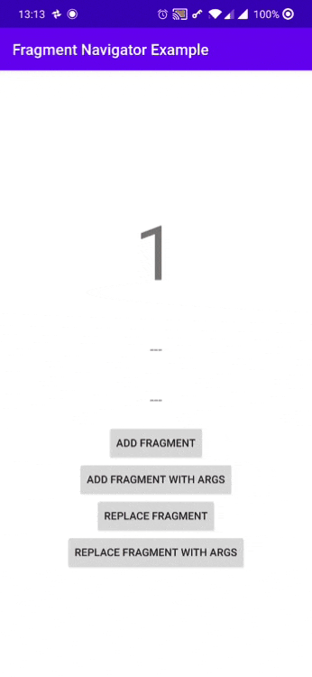
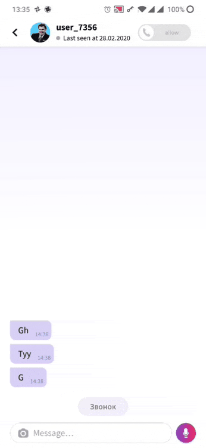
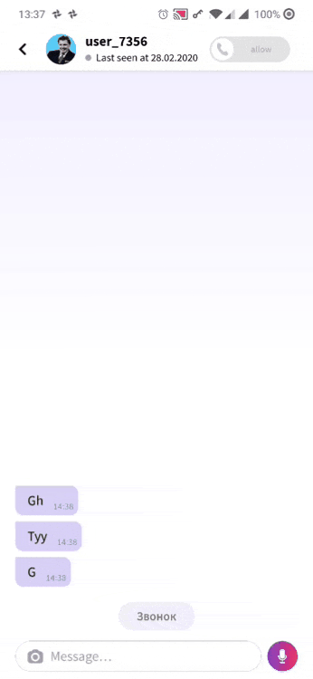

# Fragula
A simple and customizable Android fragments navigator with support "swipe to dismiss" gestures and saving a stack of fragments when changing the screen orientation


### Requirements
* A project configured with the AndroidX
* SDK 21 and and higher

### Demo Application
[](https://play.google.com/store/apps/details?id=info.yamm.project2&hl=ru)
(The app requires vk.com registration)

### Install
Download via **Gradle**:

Add this to the **project `build.gradle`** file:
```gradle
allprojects {
    repositories {
        ...
        maven { url "https://jitpack.io" }
    }
}
```

And then add the dependency to the **module `build.gradle`** file:
```gradle
implementation 'com.github.shikleyev:fragula:1.0'
```





